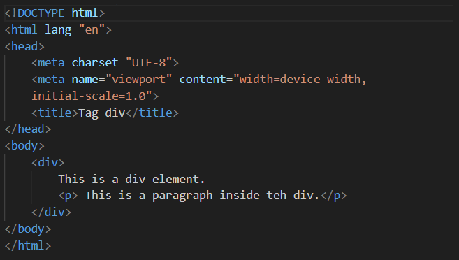
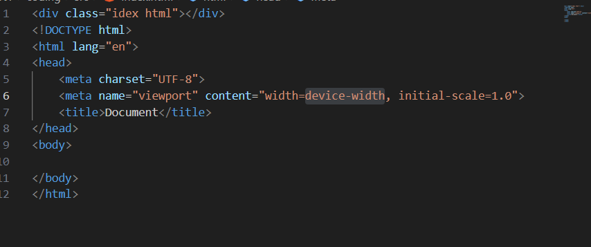
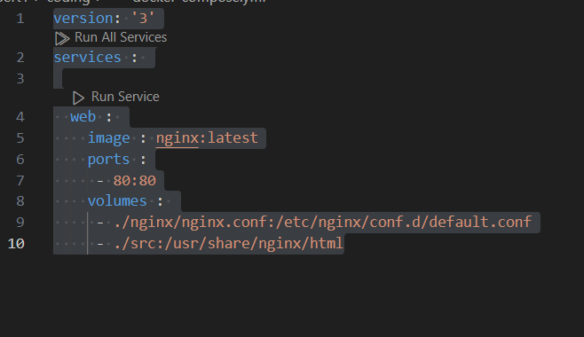

# *jam 9 - 12*
* Set-up tools
* Menjelaskan kenapa pakai tools doker,navicat dll
* Melakukan build docker compose di folder coding
* Membuat file index.html di dalam src

# HTML

* Buat  folder coding yg di dalam nya ada file .env dan docker-composer.yml, dan juga ada folder nginx yg di dalam nya ada folder nginx.conf dan setelah build di folder coding lalu tambahkan div. html dan index html

$ SC nginx.conf $ 

server{

    listen 80;

    server_name localhost;

    root /usr/share/nginx/html;
    index index.html index.htm;

    location / {
        try_files $uri $uri/ =404;
    }
}

$ SC div.html $

SC index.html

$SC .env$

COMPOSE_PROJECT_NAME=esgul

REPOSITORY_NAME=pemweb

IMAGE_TAG=latest

$SC docker-composer.yml$

     

# Kegiatan
1. Set up
2. Membuat portofolio
3. Membuat  Company Profile

* tag_a html adalah =Dalam HTML, tag yang digunakan untuk membuat link (tautan) adalah tag < a >. Tag ini memungkinkan kamu menghubungkan satu halaman dengan halaman lain, baik dalam situs yang sama maupun ke website lain. Tag < a > memiliki beberapa atribut utama yang dapat digunakan,